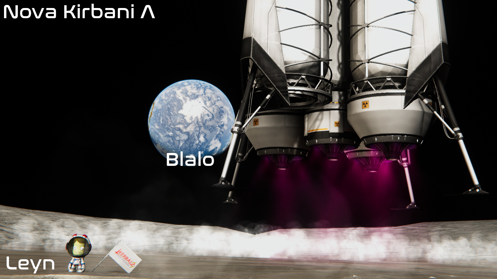
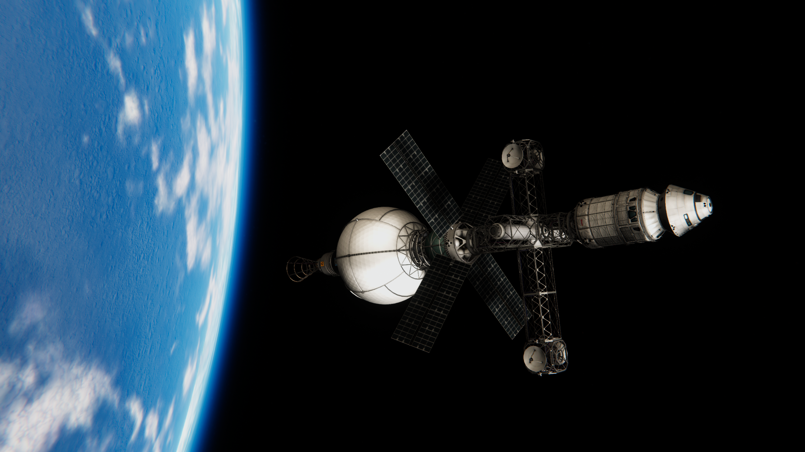
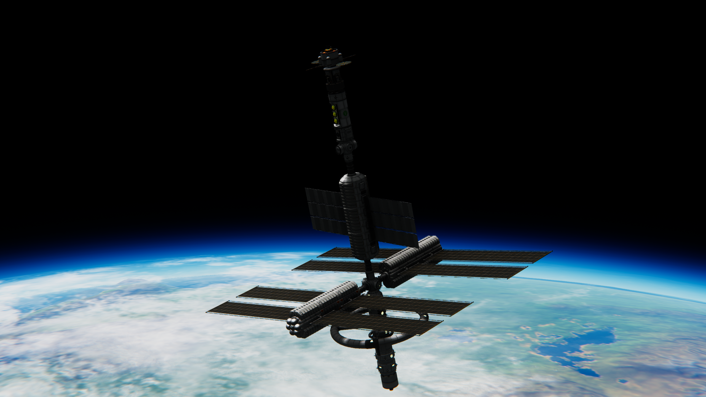
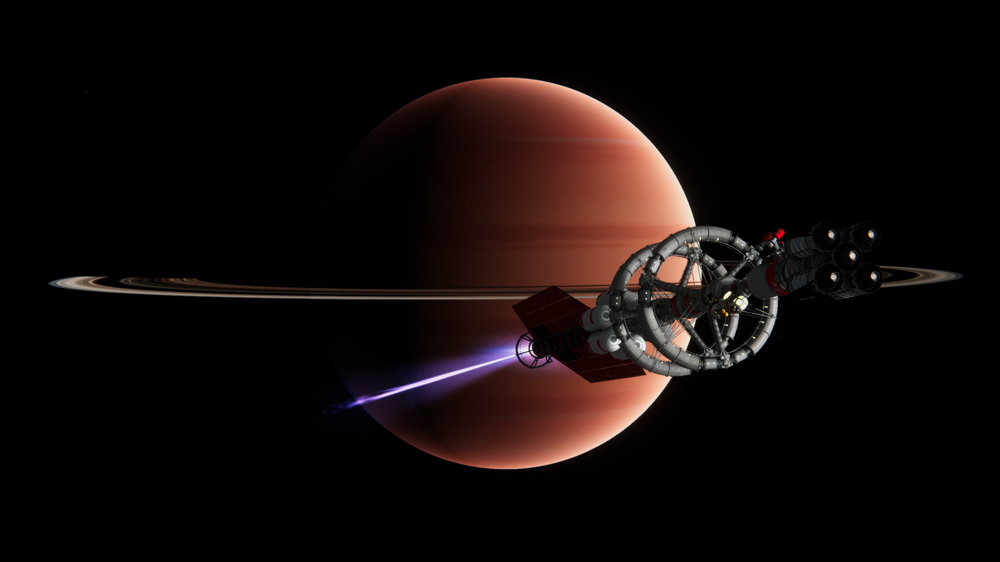
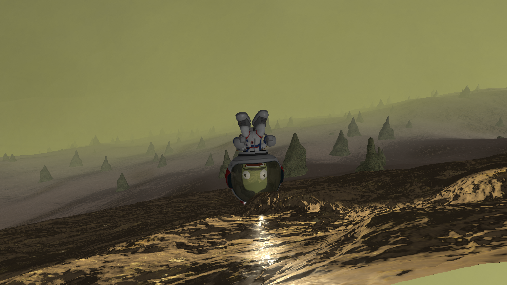

    

# Table of contents

<!-- TOC -->

- [Table of contents](#table-of-contents)
- [Kinda KSP2](#kinda-ksp2)
    - [Prologue](#prologue)
    - [Features in full suite of modlists](#features-in-full-suite-of-modlists)
    - [Installing the mods](#installing-the-mods)
        - [Prerequisites](#prerequisites)
        - [Add/make a new game instance](#addmake-a-new-game-instance)
        - [Setup and install](#setup-and-install)
        - [Non-CKAN mods](#non-ckan-mods)
            - [Galaxies Unbound](#galaxies-unbound)
            - [TURD Recoloring](#turd-recoloring)
                - [~~No, we're not recoloring poop ya silly goose~~](#no-were-not-recoloring-poop-ya-silly-goose)
        - [Optional configurations](#optional-configurations)
            - [Extraplanetary Launchpads](#extraplanetary-launchpads)
            - [Disable parallax life on Eve](#disable-parallax-life-on-eve)
            - [Custom patches](#custom-patches)
                - [Make FFT usable on interstellar scales](#make-fft-usable-on-interstellar-scales)
                - [Alternatively, use Interstellar Extended](#alternatively-use-interstellar-extended)
            - [Documentation](#documentation)
        - [Optional/experimental: multiplayer](#optionalexperimental-multiplayer)
        - [Optional: installing the flag](#optional-installing-the-flag)
        - [Other](#other)
        - [Screenshot gallery](#screenshot-gallery)

<!-- /TOC -->

# Kinda KSP2

## Prologue

This repo is basically a pack of modpacks but hopes to be dedicated to a set of resources that will attempt to make KSP1 resemble the end of the early access road map promised version of KSP2 as near as possible.

This exists because many are unwilling/unable to fork over the 50$ for KSP2 yet due to absurd system requirements or not wishing to buy on promises.
That is not to say that there have been no steps forward with KSP2-there absolutely have-but rather a comment on how spoiled we are with such an amazing modding community surrounding the game.
The hope is that this repo will become obsolete in the near future. In the meanwhile I tried making it as accessible as possible and am looking for contributions, both to the mod list, to the current source for the mods, and potentially for new mods to enhance the game play experience even further.

## Features in full suite of modlists

- Only about 11,000 patches, and without the planet packs, has better system requirements than KSP2! Likely GTX 970/1060, 16GB, and a decent CPU for 1080p full suite, but with certain combonations of `modlists/*.ckan` it is possible to use much less (even 4GB ram is functional with bare-minimum modlists).
- More buildings and launch sites thanks to Kerbal Konstructs & Kerbinside
- Recoloring parts thanks to TURD
- Beautiful visuals
  - Thanks to Environmental Visual Enhancement (EVE) and Astronomer's Visual Pack (AVP), Textures Unlimited Special Effects (TUFX), Waterfall, Planetshine, etc (clouds, atmospheric scattering, post processing, engine effects, etc)
  - Terrain scattering thanks to Parallax (grass, trees, rocks, etc)
- Many, many more star systems thanks to Galaxies Unbound
- Interstellar-rated engines and resource system thanks to Far Future Technologies
- Useful kolonization resource chains thanks to Modular Kolonization Systems, Planetary Base Systems, & Extraplanetary Launchpads
- Useful utilities
- Much, much more

## Installing the mods

### Prerequisites

1. Download the ZIP of this repo

2. If you don't already have CKAN, download it [here](https://github.com/KSP-CKAN/CKAN/releases).

3. This repo assums you are running Windows, as I have only tested this on Windows. Some mods may not work fully on Linux (for example Parallax last time I tried it), and I can't test macOS.

### Add/make a new game instance

1. I recommend to make a copy of a fresh install, or if you already have a modded instance, make a copy and delete everything in GameData except Squad and SquadExpansion as well as the CKAN folder (instance_name/CKAN) for cleanliness. This makes it easier to try different things without messing up a working install.
2. Add your game instance, either where steam installed it by right clicking on the game->manage->browse local files, and selecting the BuildID64 in that directory in CKAN, or wherever you store your brand new KSP(2).

### Setup and install

1. Go to settings->compatible game versions and select all versions down to 1.3 (I promise it's fine).
2. Go to file->install from .CKAN and select the packs you wish to install one by one from the `modlists/*.ckan` in this repo. The reason it's not all-in-one is because sometimes you want only a subset of the mods, but mostly because CKAN often has issues (recently tried installing and it took hours and multipule retries) so it's advisable to do it in chunks.

Again, sometimes CKAN runs into some issues installing and gets really slow or stuck, I usually cancel and try it again a few times. If nothing else works, just use the .ckan file as a list to search and install individually, sorry.

### Non-CKAN mods

#### Galaxies Unbound

Follow the instructions [here](https://github.com/StarCrusher96/Galaxies-Unbound-A-Stellar-Odyssey/blob/main/README.md#installation) to add other stars, yes that's right, INTERSTELLAR TRAVEL.

#### TURD Recoloring

##### ~~No, we're not recoloring poop ya silly goose~~

Follow the instructions [here](https://forum.kerbalspaceprogram.com/index.php?/topic/174188-112x-textures-unlimited-recolour-depot/) to add the ability to recolor stock parts (mostly just stock plane parts and a small selection of other ones) to your game. Looks amazing for the parts it does work on.

### Optional configurations

#### Extraplanetary Launchpads

Outdated Extraplanetary Launchpads installation instructions, should now work with CKAN.

There (was) a corruption in the zipped build of extraplanetary launchpads (as of April, 2023) that makes CKAN unable to install it, instead download the zip from <http://taniwha.org/~bill/ExtraplanetaryLaunchpads_v6.99.3.zip> and skip the corrupted file when you unzip.
Then copy+paste it into the GameData directory under your KSP installation.

[!] However, Extraplanetary Launchpads now appears to remove the magnetometer (in favor of its own), potentially breaking pre-existing kraft, if this affects you simply use a text editor to:

1. Find the file `UmbraSpaceIndustries\MKS\Patches\PatchManager\PluginData\MKS_EL_Parts.cfg` and comment the line `!PART[Magnetometer]:NEEDS[Launchpad]:AFTER[Launchpad] {}` with `//` at the beginning.
2. Do the same for the line in `ELNoProduction\GameData\IrishmanIndustries\hideMOST_ELMKS.cfg`

#### Disable parallax life on Eve

Copy-paste the `_Scatters` folder in [this](https://drive.google.com/file/d/16-nTUbRgQescq4ajQtka1cJnaOzPcgPy/view) patch to `GameData/Parallax_StockTextures/`

#### Custom patches

1. To include water in the production chain of NSW instead of just ore (makes more sense, and higher mass yield) put `patches/fft-nuclear-smelter-375-1.cfg` in `GameData/FarFutureTechnologies/Parts/Resources`.
2. To have the ability to produce LH2 from water put `patches/LH2-conversion.cfg` in `GameData/`

##### Make FFT usable on interstellar scales

Unzip and place [this](https://cdn.discordapp.com/attachments/859062295698997289/870368460251742248/PatchEmporium.zip) patch written by Hosk in GameData for better kompatibility with GU.

- Calvin's FFT Isp fixes.
- Calvin's Kerbal Atomics Isp fix (just the 2.5m GCNTR).
- CryoTanks fusion fuel options (D, He3, D+He3).
- AntiMatter tank buff (hold 3x as much, require 2x as much cooling).
- BCAM propellant ratio fix.
- Stock Convert-O-Tron: Uraninite -> EnrU
- Extra: Disable specialist requirement on converters on (hopefully) all parts that are drills or converters.

##### Alternatively, use Interstellar Extended

Find more details [here](https://forum.kerbalspaceprogram.com/topic/173818-181-1122-ksp-interstellar-extended-1295-release-thread/). Beware it has more komplications!

#### Documentation

- USI: There's some great documentation [here](https://github.com/UmbraSpaceIndustries/MKS/wiki), there's also integrated information in the integrated KSPedia.
- GU: Don't know where to go? Konsult your star chart, now avalible [here](https://github.com/UmbraSpaceIndustries/MKS/wiki).
- KSP IE wiki is [here](https://github.com/sswelm/KSP-Interstellar-Extended/wiki).
- Please help me add more...

### Optional/experimental: multiplayer

DISCLAIMER: I have not tested this and have no idea if it works with so many mods but it's here if you want to give it a go. [Here](https://github.com/LunaMultiplayer/LunaMultiplayer/wiki/Mod-support) is some info on mod support. It does note it is explicitly not compatible with USI LS as well as other LS mods, Kerbal Konstructs, and VesselMover.

Follow the instructions [here](https://github.com/LunaMultiplayer/LunaMultiplayer/wiki/How-to-install-LMP) for client and server setup. Make sure whoever you are playing with also has followed the instructions in this repo and you have the same client otherwise it is unlikely work.

### Optional: installing the flag

Put [this](flag/underconstruction.png) flag in your KSP(2) directory under GameData->Squad->Flags

### Other

Please consider a donation to the creators of these mods if you find value in them, especially value similar to that of KSP2 (keep in mind the $50!).

If you want the volumetric clouds (early access) you can subscribe to [Blackrack's Patreon](https://www.patreon.com/blackrack/posts), download, and follow the instructions there.

TODOs:

- [ ] Extensive List of mod devs and donate links.

Note:

1. I did not include Interstellar Extended because it was older, not as compatible other mods, and I think far future tech looks cooler. Although I would like to see a Daedalus Project type engine, I know the developer of FFT said they were overrated, I must disagree because they do look epic.
2. I did not include Orion drives by RoverDude because it does not integrate well into the resource system. This is potentially an easy fix in a patch to change the fuel to something from FFT, or, for more realism an ISRU that creates bomb pellets from Enr U. I will look into this for future patches.
3. I did not include tweakscale because I often find it to be buggy, and it breaks balance (too much scaling creates OP engines)

Congrats, you (hopefully) just saved $50! I unfortunately did not make it in time :(

If you did find this repo to be helpful please give it a star and/or submit an issue with suggestions, issues, and most importantly screenshots.

### Screenshot gallery

