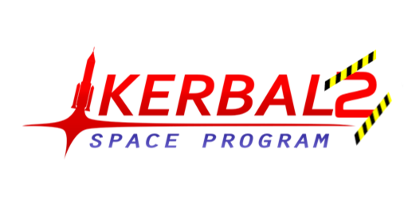

    

# Kinda KSP2

## Prologue

This repo is basically a modpack but hopes to be dedicated to a set of resources that will attempt to make KSP1 resemble the end of the early access road map promised version of KSP2 as near as possible.

This exists because many are unwilling/unable to fork over the 50$ for KSP2 yet due to absurd system requirements or not wishing to buy on promises.
That is not to say that there have been no steps forward with KSP2-there absolutely have-but rather a comment on how spoiled we are with such an amazing modding community surrounding the game.
The hope is that this repo will become obsolete in the near future. In the meanwhile I tried making it as accessible as possible and am looking for contributions, both to the mod list, to the current source for the mods, and potentially for new mods to enhance the game play experience even further.

## Features in modpack

* Only about 11,000 patches, and without the planet packs, has better system requirements than KSP2! Likely GTX 970/1060 for 1080p, though I have not tested it.
* More buildings and launch sites thanks to Kerbal Konstructs & Kerbinside
* Recoloring parts thanks to TURD
* Beautiful visuals
  * Various thanks to Environmental Visual Enhancement (EVE) and Astronomer's Visual Pack (AVP), Textures Unlimited Special Effects (TUFX), Waterfall, Planetshine, etc (clouds, atmospheric scattering, post processing, engine effects, etc)
  * Terrain scattering thanks to Parallax (grass, trees, rocks, etc)
* More star systems thanks to Galaxies Unbound
* Interstellar-rated engines and resource system thanks to Far Future Technologies
* Useful kolonization resource chains thanks to Modular Kolonization Systems, Planetary Base Systems, & Extraplanetary Launchpads
* Much, much more

## Installing the mods

### Prerequisites

Download the ZIP of this repo

If you don't already have CKAN, download it [here](https://github.com/KSP-CKAN/CKAN/releases).

This repo assums you are running Windows, as I have only tested this on Windows. Some mods may not work fully on Linux (for example Parallax last time I tried it), and I can't test macOS.

### Add your game instance

Add your game instance, either where steam installed it by right clicking on the game->manage->browse local files, and selecting the BuildID64 in that directory in CKAN, or wherever you store your KSP(2). I recommend to make a copy of your current install and call it something like "Kerbal Space Program Too" This makes it easier to try different things.

### Setup and install

Go to settings->compatible game versions and select all versions down to 1.3
Go to file->install from .CKAN and select the file in this repo

There's corruption in the zipped build of extraplanetary launchpads that makes CKAN unable to install it, instead download the zip from <http://taniwha.org/~bill/ExtraplanetaryLaunchpads_v6.99.3.zip> and skip the corrupted file when you unzip
Then copy+paste it into the GameData directory under your KSP installation

### Recoloring

IMPORTANT: It seems this gets rid of your IVA view, not sure why this is and do not have time to debug it/do a good bug report so if you want recoloring you're stuck with it for now.

Follow the instructions [here](https://forum.kerbalspaceprogram.com/index.php?/topic/174188-112x-textures-unlimited-recolour-depot/) to add the ability to recolor stock parts to your game. Does not appear to be on CKAN.

### Optional: multiplayer

DISCLAIMER: I have not tested this and have no idea how it works with so many mods but it's here if you want to give it a go. [Here](https://github.com/LunaMultiplayer/LunaMultiplayer/wiki/Mod-support) is some info on mod support.

Follow the instructions [here](https://github.com/LunaMultiplayer/LunaMultiplayer/wiki/How-to-install-LMP) for client and server setup. Make sure whoever you are playing with also has followed the instructions in this repo otherwise it will not work.

### Optional: installing the flag

Put [this](flag/underconstruction.png) flag in your KSP(2) directory under GameData->Squad->Flags

### Other

Please consider a donation to the creators of these mods if you are using them as a replacment for KSP2.

If you want the volumetric clouds you can go to [Blackrack's Patreon](https://www.patreon.com/blackrack/posts).

TODOs:

- [ ] List of mod devs and donate links
- [ ] List of resources to actually know how to play this heavily modified version of the game
- [ ] Make 'optimized' version (less mods)-or try and improve/try some of the mods for lower-spec laptops
- [ ] Record and compare to the sequel (performance, features, bugs) to see when this will become obsolete
- [ ] Make more mods to replicate the features of KSP2 as close as possible/we want to

Note:

1. I did not include Interstellar Extended because it was older, not compatible with far future tech, and I think far future tech looks cooler. Although I would like to see a Daedalus Project type engine, though I know the developer said they were overrated they do look epic.
2. I did not include Orion drives by RoverDude because it does not integrate well into the resource system. This is potentially an easy fix in a patch to change the fuel to something from FFT, or, for more realism an ISRU that creates bomb pellets from Enr U.
3. I did not include tweakscale because I often find it to be buggy, and it breaks balance, in that too much scaling creates OP engines
4. This is not meant to be a full list of everything you need, please submit a pull request to improve it.
5. Disable life on Eve with [this](https://drive.google.com/file/d/16-nTUbRgQescq4ajQtka1cJnaOzPcgPy/view) patch
